# django-rest-framework-12th
## 2주차 스터디

### 모델링 & Django ORM

### 서비스 설명

쇼핑몰 서비스 만들기

### 모델 설명
**<초기 모델링>**

*유저 모델: 

Customer: 고객(회원과 관련된 정보 포함)  / PK: User 모델의 id(IntegerField)

*서비스 관련 모델:  

Product: 상품/ PK: id(CharField)

Order: 주문/ PK: order_number(IntegerField)

Cart: 장바구니/ PK: Customer의 id

Reviews: 리뷰/ PK: id(BigAutoField)

QnA: 문의/ PK: id(BigAutoField)

Answer: 답변 / PK: id(BigAutoField)

<모델 간 관계>

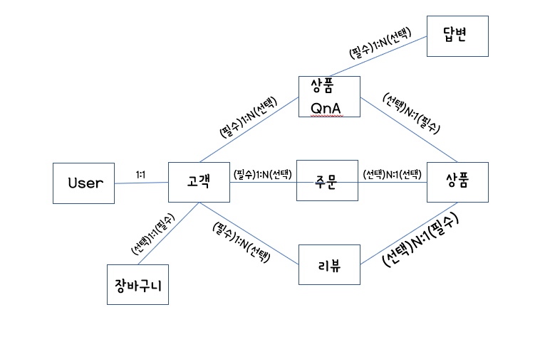

**<수정 모델링>**

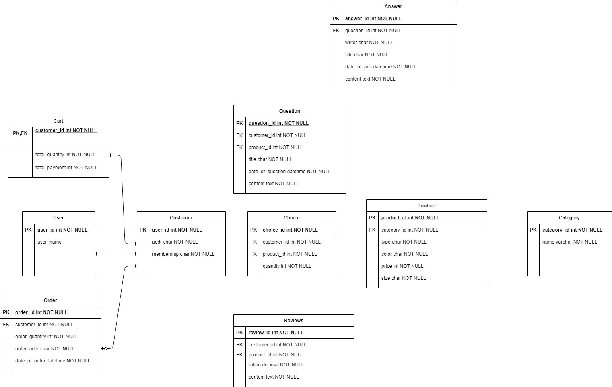

### ORM 적용해보기

1.데이터베이스에 Reviews 모델 객체 3개 생성

순서: User 모델 객체 2개 생성 → Customer 모델 객체 2개 생성 → Product 모델 객체 2개 생성 → Reviews 모델 객체 3개 생성

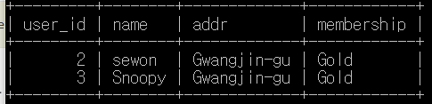

```python
from api.models import Customer
c1 = Customer(user=u1, name = "sewon", addr = "Gwangjin-gu", membership = "Gold")
c2 = Customer(user=u2, name = "Snoopy", addr = "Gwangjin-gu", membership = "Gold")

```

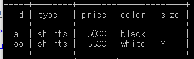

```python
from api.models import Product
p1 = Product(id="a", type = "shirts", price = 5000, color = "black", size="L")
p2 = Product(id = "aa", type = "shirts" price = 5500, color = "white", size="M")
```

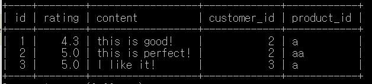

```python
from api.models import Reviews
Reviews.objects.create(rating = 4.3, content = "this is good!", customer = c1, product = p1)
Reviews.objects.create(rating = 5.0, content = "this is perfect!", customer = c1, product = p2)
Reviews.objects.create(rating = 5.0, content = "I like it!", customer = c2, product = p2)
```

2.삽입한 객체들 쿼리셋으로 조회하기

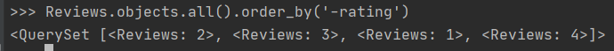

Reviews 모델의 객체들을 rating(평점)을 기준으로 내림차순으로 조회함

3.filter 함수 사용하기

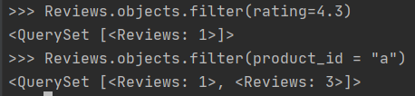


### 간단한 회고 

구상한 서비스에 필요한 모델들을 직접 구상하는 것이 낯설었고, 모델 관의 정확한 관계, PK와 FK를 정확히 지정하는 것이 중요하다는 것을 깨달았다. 


## 3주차 스터디

### DRF1 : API View

### 모델 선택 및 데이터 삽입

```python
#유저 모델
#새로운 모델 생성해서 기존의 User Model과 OneToOne 으로 연결하는 방식
class Customer(models.Model) :
    user = models.OneToOneField(User, on_delete=models.CASCADE, primary_key=True)#User모델의 user_id 필드를 PK로 지정
    addr = models.CharField(max_length=100)#추후에 확실히 찾아볼 것!
    membership = models.CharField(max_length=10)
    #적립금..?
    class Meta:
        db_table = 'customers'
        verbose_name = 'Customer'
        verbose_name_plural = 'Customers'

    def __str__(self):
        return self.user.username #관리자에서 객체 생성시 username으로 보임


#서비스 관련 모델1) 상품
#모든 항목 not NULL
class Product(models.Model) :
    #choices 생성 for type
    TYPE_CHOICES = [
        ('OUTERWEAR', 'OUTERWEAR'),
        ('TOPS', 'TOPS'),
        ('SHIRTS', 'SHIRTS'),
        ('BOTTOMS', 'BOTTOMS'),
        ('SKIRTS', 'SKIRTS'),
        ('DRESSES', 'DRESSES'),
        ('BAGS', 'BAGS'),
    ]
    type = models.CharField(max_length=9, choices=TYPE_CHOICES, default='TOPS')
    price = models.IntegerField()
    color = models.CharField(max_length=10)
    size = models.CharField(max_length=3)
    customer = models.ManyToManyField(Customer, through='Choice')#through 옵션 사용
    #+적립금..?
    class Meta:
        db_table = 'products'
        verbose_name = 'Product'
        verbose_name_plural = 'Products'
        ordering = ['id']

    def __str__(self):
        return str(self.id)

#서비스 관련 모델 추가) 선택(유저모델과 product를 연결할 mapping table)
class Choice(models.Model):
    #FK
    customer = models.ForeignKey(Customer, on_delete=models.CASCADE, related_name='choices')
    #FK
    product = models.ForeignKey(Product, on_delete=models.CASCADE, related_name='choices')
    quantity = models.IntegerField()

    class Meta:
        db_table = 'choices'
        verbose_name = 'Choice'
        verbose_name_plural = 'Choices'
        ordering = ['id']

    def __str__(self):
        return str(self.id)
        
```

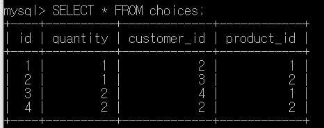

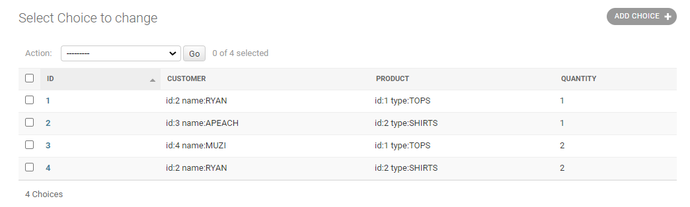


### 모든 list를 가져오는 API

->모든 Choice 객체 가져오는 API 요청 결과

URL: api/choices/

Method: GET

```json
[
    {
        "id": 1,
        "quantity": 1,
        "customer": 2,
        "product": 1
    },
    {
        "id": 2,
        "quantity": 1,
        "customer": 3,
        "product": 2
    },
    {
        "id": 3,
        "quantity": 2,
        "customer": 4,
        "product": 1
    },
    {
        "id": 4,
        "quantity": 2,
        "customer": 2,
        "product": 2
    }
]
```

->모든 User 객체 가져오는 API 요청 결과

URL: api/users/

Method: GET

```json
[
    {
        "id": 1,
        "username": "admin",
        "customer": null
    },
    {
        "id": 2,
        "username": "RYAN",
        "customer": {
            "addr": "서울시 광진구",
            "membership": "purple"
        }
    },
    {
        "id": 3,
        "username": "APEACH",
        "customer": {
            "addr": "서울시 서대문구",
            "membership": "purple"
        }
    },
    {
        "id": 4,
        "username": "MUZI",
        "customer": {
            "addr": "서울시 광진구",
            "membership": "purple"
        }
    }
]
```

->모든 Product 객체 가져오는 API 요청 결과

URL: api/products/

Method: GET

```json
[
    {
        "id": 1,
        "type": "TOPS",
        "price": 5000,
        "color": "black",
        "size": "M"
    },
    {
        "id": 2,
        "type": "SHIRTS",
        "price": 6000,
        "color": "blue",
        "size": "L"
    }
]
```


### 특정한 데이터를 가져오는 API

->3번째 choice를 가져오는 API 요청 결과

URL: api/choices/3/

Method: GET

```JSON
{
    "id": 3,
    "quantity": 2,
    "customer": 4,
    "product": 1
}
```


### 새로운 데이터를 create하도록 요청하는 API

->Choice 객체를 추가하는 API 요청 결과

URL: api/choices/

Method: POST

Body: {"quantity": 3, "customer":2, "product":2}

```json
{
    "id": 5,
    "quantity": 3,
    "customer": 2,
    "product": 2
}
```


### 특정 데이터를 삭제 또는 업데이트하는 API

->id 값이 5인 Choice 객체 제거하는 API 요청 결과

URL: api/choices/5/

Method: DELETE

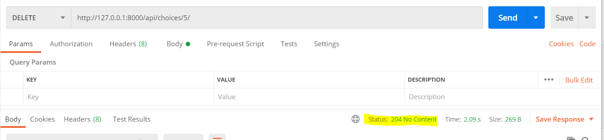


### 공부한 내용 정리

*URL과 URI의 차이점

URL: 인터넷 상의 자원 위치를 나타냄

URI: 인터넷 상의 자원을 식별하기 위한 문자열의 구성

*Serializer 

사용 이유: JSON으로 데이터를 보내야하는 RESTful API를 위해 Queryset을 Nested한 JSON으로 매핑하는 과정이 필요한데, Serializer 그 역할을 수행함

(기존 장고는 장고 ORM의 Queryset은 장고 template으로 넘겨지며 HTML로 렌더링되어 Response로 보내짐)

*APIView

CBV(클래스 기반 뷰) 중 하나여서 하나의 URL에 대해 처리 가능

ex)

/post/에 대한 CBV -> get: 목록, post: 새로운 객체 생성

/post/< int : pk >/ 에 대한 CBV -> get: pk번 객체 내용, put: pk번 객체 수정, delete: pk번 객체 삭제

*ModelAdmin

특정 모델 클래스를 admin에 등록하여 사용 가능

->방법: admin.ModelAdmin 상속, decorator 형태로 등록(@admin.register(Post))

->옵션: list_display(Admin 목록에 보여질 필드 목록)

### 간단한 회고

Serializer나 APIView을 사용하는 이유에 대해 알아가며 순차적으로 진행할 수 있었다.


# 4주차 스터디

### DRF2 : ViewSet 

### ViewSet으로 리팩토링하기 

```python
from rest_framework import viewsets
from rest_framework.response import Response
from rest_framework.decorators import action

#User
class UserViewSet(viewsets.ModelViewSet):
    serializer_class = UserSerializer
    queryset = User.objects.all()

#Customer
class CustomerViewSet(viewsets.ModelViewSet):
    serializer_class = CustomerSerializer
    queryset = Customer.objects.all()

#product
class ProductViewSet(viewsets.ModelViewSet):
    serializer_class = ProductSerializer
    queryset = Product.objects.all()

#Category
class CategoryViewSet(viewsets.ModelViewSet):
    serializer_class = CategorySerializer
    queryset = Category.objects.all()
    
#Cart
class CartViewSet(viewsets.ModelViewSet):
    serializer_class = CartSerializer
    queryset = Cart.objects.all()

#choice
class ChoiceViewSet(viewsets.ModelViewSet):
    serializer_class = ChoiceSerializer
    queryset = Choice.objects.all()

```


### @action 추가하기

1. ##### 특정 category_id에 속하는 product 객체 보여주기

Method : GET

URL : api/products/{pk}/category  -> pk는 category_id

```python
#product
class ProductViewSet(viewsets.ModelViewSet):
    serializer_class = ProductSerializer
    queryset = Product.objects.all()

    @action(methods=['get'], detail=True)
    def category(self, request, pk):
        products = Product.objects.all().filter(category=pk)
        serializer = self.get_serializer(products, many=True)
        return Response(serializer.data)

```

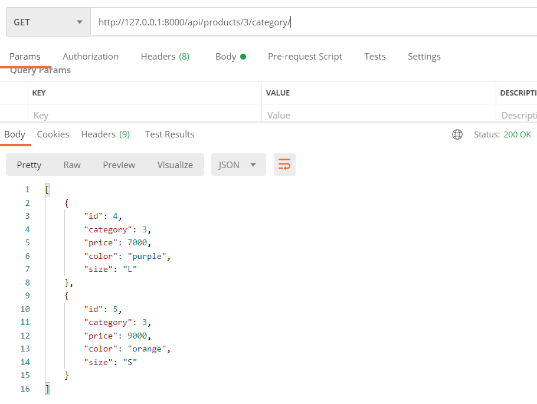

2. ##### 특정 customer_id에 속하는 choice 객체 보여주기

Method : GET

URL : api/choices/{pk}/customer -> pk는 customer_id

```python
#choice
class ChoiceViewSet(viewsets.ModelViewSet):
    serializer_class = ChoiceSerializer
    queryset = Choice.objects.all()
    
    @action(methods=['get'], detail=True)
    def customer(self, request, pk):
        choices = Choice.objects.filter(customer_id=pk)
        serializer = self.get_serializer(choices, many=True)
        return Response(serializer.data)
```

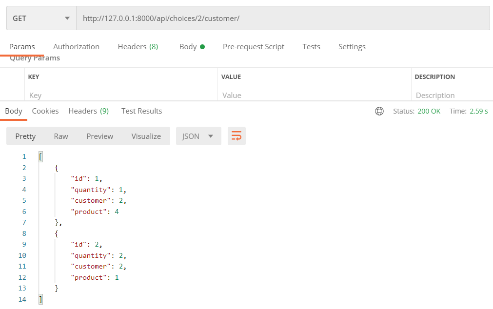


### 공부한 내용 정리

- **ViewSet**

 1. DRF화) django view --> rest_framework APIView

 2. 패턴화) APIView --> Generic Views

 3. 구조화) Generic Views --> ViewSets

    **[ModelViewSet 함수 및 속성]** http://www.cdrf.co/3.1/rest_framework.viewsets/ModelViewSet.html

- **Router 사용해 url 매핑하기** 

  ModelViewSet : list, create, retrieve, update, destroy actions 제공

  ->retrieve, update, destroy view: model_name/< int:pk >/ 형태의 url 사용해 해당 pk에 해당하는 인스턴스 보델 보여주거나, 업데이트하거나, 제거해주는 역할

  ->list, create view: 형태의 url 사용해 해당 pk에 해당하는 인스턴스 보델 보여주거나, 업데이트하거나, 제거해주는 역할

  

- **Routing for extra actions**

  ```python
  from myapp.permissions import IsAdminOrIsSelf
  from rest_framework.decorators import action
  
  class UserViewSet(ModelViewSet):
      ...
  
      @action(methods=['post'], detail=True, permission_classes=[IsAdminOrIsSelf])
      def set_password(self, request, pk=None):
          ...
  ```

  -> URL pattern : ^users/{pk}/set_password/$

  -> URL name : 'user-set-password'

  ```python
  from myapp.permissions import IsAdminOrIsSelf
  from rest_framework.decorators import action
  
  class UserViewSet(ModelViewSet):
      ...
  
      @action(methods=['post'], detail=True, permission_classes=[IsAdminOrIsSelf],
              url_path='change-password', url_name='change_password')
      def set_password(self, request, pk=None):
          ...
  ```

  →URL path : ^users/{pk}/change-password/$

  →URL name : 'user-change_password'

  **[Django문서 Routers]** https://www.django-rest-framework.org/api-guide/routers/#custom-routers


# 5주차 스터디

### DRF4 : Filtering과 Permission

### Filtering 적용

```python
import django_filters
from django_filters.rest_framework import FilterSet, filters
from django_filters.rest_framework import DjangoFilterBackend

class ProductFilter(django_filters.FilterSet):
    # ex) urls: api/products?category=1&price_lte=10000 -> category, price 인자 전달
    category = django_filters.NumberFilter()
    price = django_filters.NumberFilter()
    color = django_filters.CharFilter(method='my_custom_color')

    class Meta:
        model = Product
        fields = {
            'price' : ['lte'], #generate 'price__lte' filters
            'color' : ['iexact'] #generate 'color__iexact' filters
        }
    
    #ex) urls: api/products?color=black
    def my_custom_color(self, queryset, name, value): #value = query param의 값 ex)api/products/?color=orange -> value = orange
        #construct the full lookup expression
        lookup = '__'.join([name, 'iexact']) #lookup = color__iexact
        return queryset.filter(**{lookup: value}) #color__iexact의 값이 value인 객체만 필터링
    
    
class ProductViewSet(viewsets.ModelViewSet):
    serializer_class = ProductSerializer
    queryset = Product.objects.all()
    
    filter_backends = [DjangoFilterBackend]
    filterset_class = ProductFilter
```

1) 특정 카테고리에 속하는 상품 & 특정 값 이하의 상품 보여주기

METHOD : GET

URL : api/products/?category=3&price_lte=10000

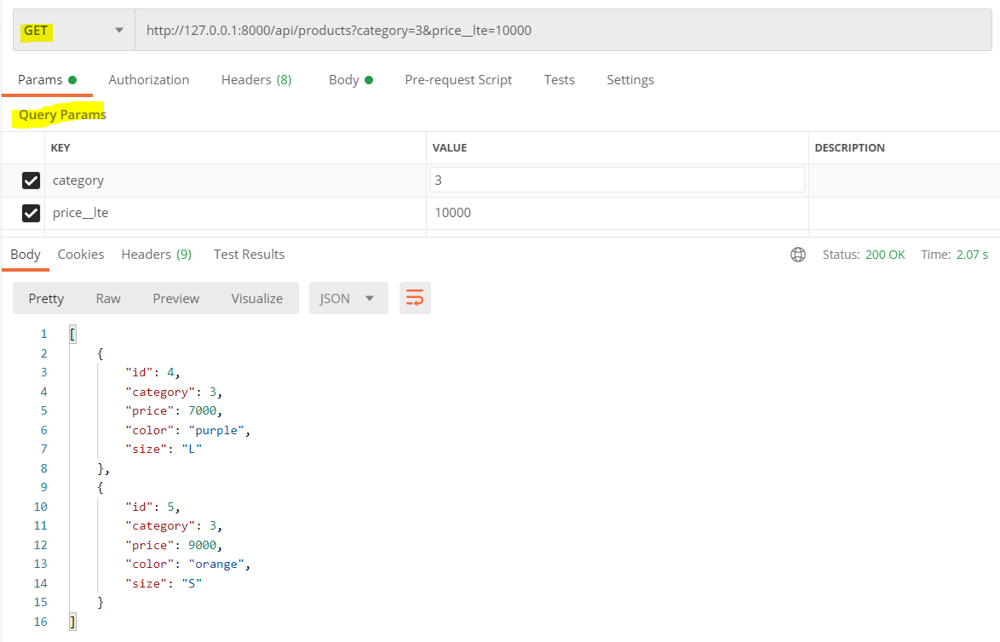

2)특정 색깔의 상품 보여주기(method 사용)

METHOD : GET

URL : api/products/?color=black

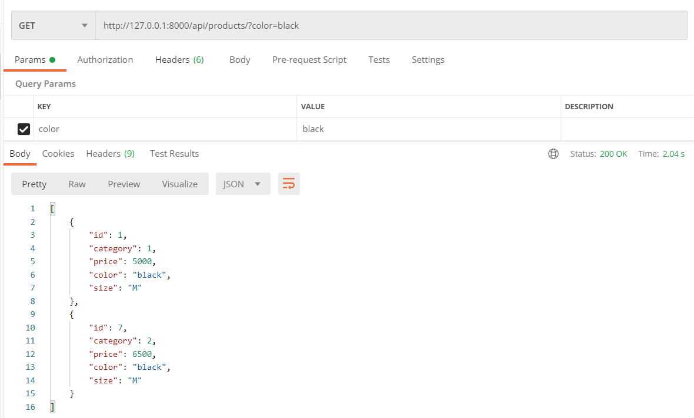


### Permission 적용

```python
#permission.py

from rest_framework import permissions
from rest_framework.permissions import BasePermission

#카트는 로그인한 유저에게만 보여지도록
class IsAuthenticated(BasePermission):
    message = 'Login is needed'
    
    def has_permission(self, request, view):
        return bool(request.user and request.user.is_authenticated)


#상품&카테고리 등록 및 삭제는 스태프에게만 허용
class AllowAny(BasePermission):
    message = 'Adding, Deleting not allowed'

    def has_permission(self, request, view):
        return True

    def has_object_permission(self, request, view, obj):

        if request.method in permissions.SAFE_METHODS: #GET, HEAD, OPTION(수정 삭제 삽입 제외)
            return True
        else:
            return request.user.is_staff
        
#models.py
from .permissions import IsAuthenticated, AllowAny

class ProductViewSet(viewsets.ModelViewSet):
    serializer_class = ProductSerializer
    queryset = Product.objects.all()
    permission_classes = [
        AllowAny,
    ]

class CategoryViewSet(viewsets.ModelViewSet):
    serializer_class = CategorySerializer
    queryset = Category.objects.all()
    permission_classes = [
        AllowAny,
    ]
    
class CartViewSet(viewsets.ModelViewSet):
    serializer_class = CartSerializer
    queryset = Cart.objects.all()

    permission_classes = [
        IsAuthenticated,
    ]

```

1) Cart Model 객체는 로그인한 해당 유저의 것만 보여주기

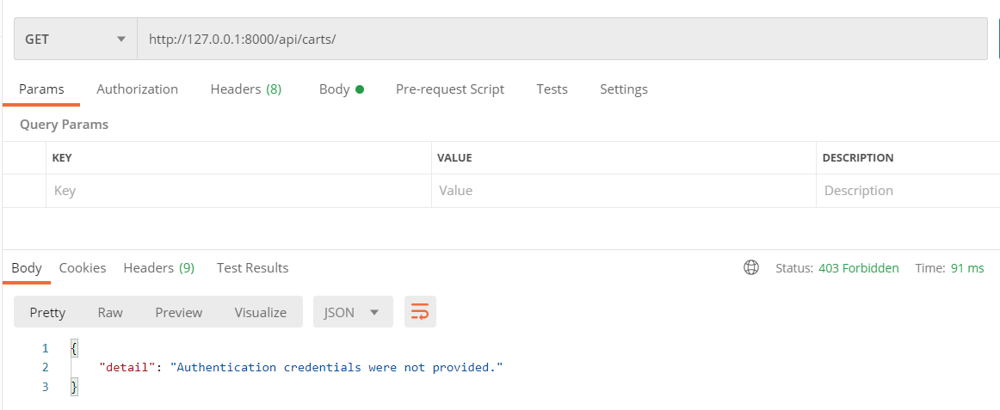


2)상품&카테고리의 객체 수정, 삭제, 삽입은 스태프에게만 허용

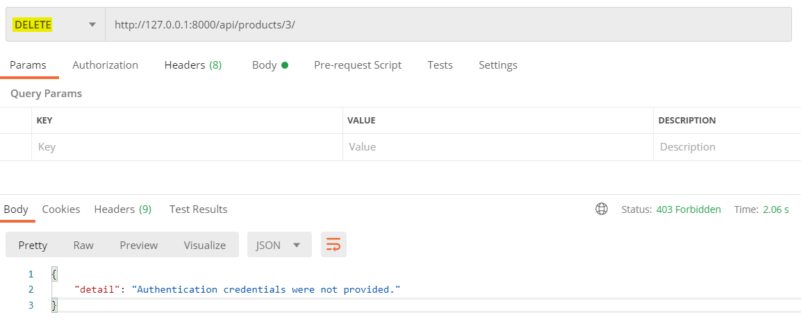

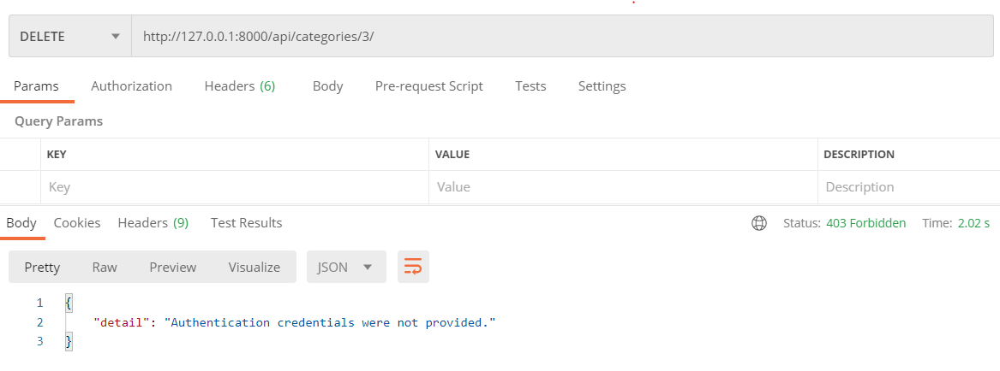

### 공부 내용 정리

- Filtering

  -어떤 queryset에 대해 원하는 옵션대로 필터를 걸어, 해당 조건을 만족하는 특정 쿼리셋을 만들어내는 작업

  -여러 개의 대상에 대해 그 중 일부만 걸러주기 위해 사용되므로, list view에서만 사용됨 

  [참고]

  [django-filter] https://django-filter.readthedocs.io/en/stable/guide/usage.html
  
  [Filter Backends] https://show-me-the-money.tistory.com/42

  [FilterSet Options] https://django-filter.readthedocs.io/en/stable/ref/filterset.html

  
  
- Permission

  -request.user & request.auth의 인증 정보 사용

  -장고는 모델에 add, change, delete permission을 자동적으로 제공

  -view의 main body 실행 전, permission 체크 먼저 수행

  ​    --> 실패 시, '403 Forbidden' or '401 Unauthorized' response 반환
  
  2가지 대표 스타일

  ​	1.IsAuthenticated

  ​	   allow access to any authenticated user
  
  ​       deny access to any unauthenticated user
  
  ​    2.IsAuthenticatedOrReadOnly
  
  ​       allow full access to authenticated user
  
  ​       allow read-only access to unauthenticated user
  
  [참고]
  
  [permission 관련 함수들] https://github.com/encode/django-rest-framework/blob/master/rest_framework/permissions.py
  
  [permission 예제] https://ssungkang.tistory.com/entry/Django-Authentication-%EA%B3%BC-Permissions
  
  
  
- Validation

  *Raising an exception on invalid data

  ```python
  #Return a 400 response if the data was invalid.
  serializer.is_valid(raise_exception=True)
  ```

  -raise_exception의 기능: raise a serializer.ValidationError exception

  -위의 exception은 REST framework가 제공하는 default exception handler이고, default로 HTTP 400 Bad Request 반환

  

  *Field-level validation

  방법) adding .validate_<field_name> methods to Serializer subclass

  ​	->해당 메서드는 validated value를 반환하거나, serializers.ValidationError 발생시켜야 함

  ​	ex) def validate_title(self, value)

  

  *Object-level validation

  2개 이상의 필드에 대한 접근이 필요할 때 사용

  방법) adding .validate() method to Serializer subclass

  ​	->해당 메서드는 validated value를 반환하거나, serializers.ValidationError 발생시켜야 함

  ​	ex) def validate(self, data)

  ​		->data = dicationary of field values

  

  *Validators

  serializer의 각각의 필드에 대해 validator 포함 가능 -> 필드 객체에 선언

  ```python
  def multiple_of_ten(value):
      if value % 10 != 0:
          raise serializers.ValidationError('Not a multiple of ten')
  
  class GameRecord(serializers.Serializer):
      score = IntegerField(validators=[multiple_of_ten])
      ...
  ```

  reusable validators 사용 -> inner Meta class에 선언

  ```python
  class EventSerializer(serializers.Serializer):
      name = serializers.CharField()
      room_number = serializers.IntegerField(choices=[101, 102, 103, 201])
      date = serializers.DateField()
  
      class Meta:
          # Each room only has one event per day.
          validators = [
              UniqueTogetherValidator(
                  queryset=Event.objects.all(),
                  fields=['room_number', 'date']
              )
          ]
  ```

  

  

  

  


